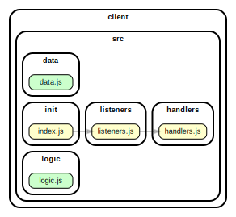

<!-- BEGIN TITLE -->

# DOCS

<!-- END TITLE -->

<!-- BEGIN TREE -->

> [interactive graph](./dependency-graph.html)

<!-- END TREE -->

<!-- BEGIN TOC -->

- public
- src
  - components
  - data
    - [data.js](#clientsrcdatadatajs)
  - handlers
    - [handlers.js](#clientsrchandlershandlersjs)
  - init
    - [index.js](#clientsrcinitindexjs)
  - listeners
    - [listeners.js](#clientsrclistenerslistenersjs)
  - logic
    - [logic.js](#clientsrclogiclogicjs)
- styles

---

<!-- END TOC -->

<!-- BEGIN DOCS -->

# /public

---

# /src

## /components

---

## /data

<a href="../../client/src/data/data.js" id="clientsrcdatadatajs">../client/src/data/data.js</a>

---

## /handlers

<a href="../../client/src/handlers/handlers.js" id="clientsrchandlershandlersjs">../client/src/handlers/handlers.js</a>

---

## /init

<a href="../../client/src/init/index.js" id="clientsrcinitindexjs">../client/src/init/index.js</a>

---

## /listeners

<a href="../../client/src/listeners/listeners.js" id="clientsrclistenerslistenersjs">../client/src/listeners/listeners.js</a>

---

## /logic

<a href="../../client/src/logic/logic.js" id="clientsrclogiclogicjs">../client/src/logic/logic.js</a>

---

---

# /styles

---

<!-- END DOCS -->
